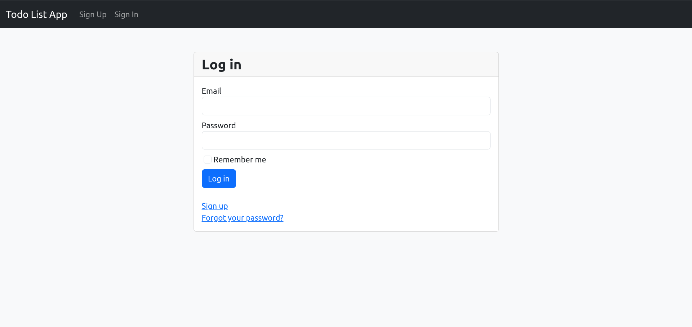
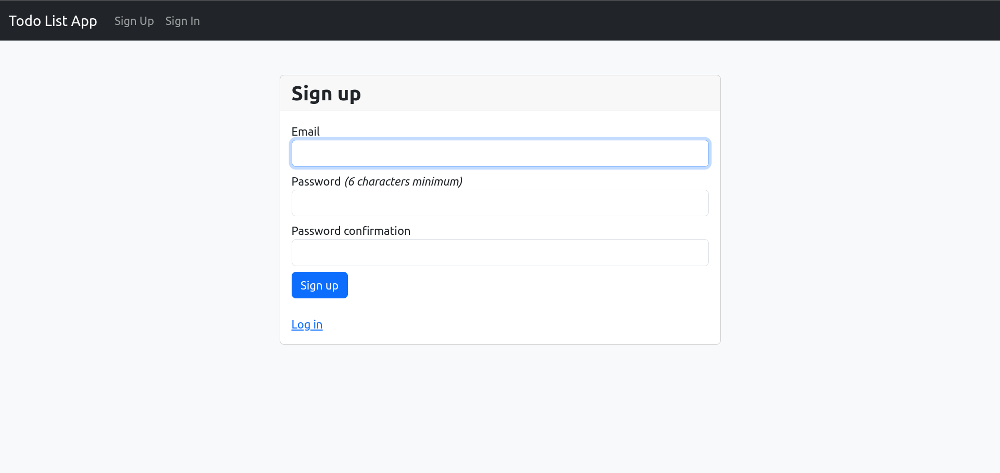
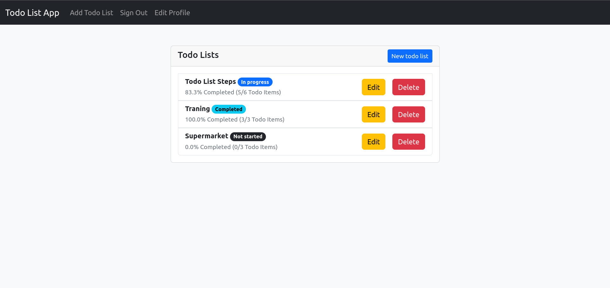
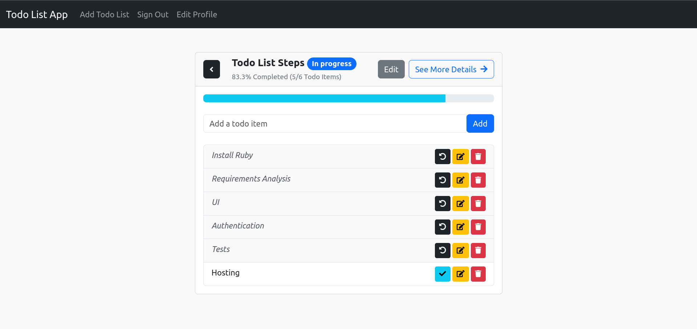
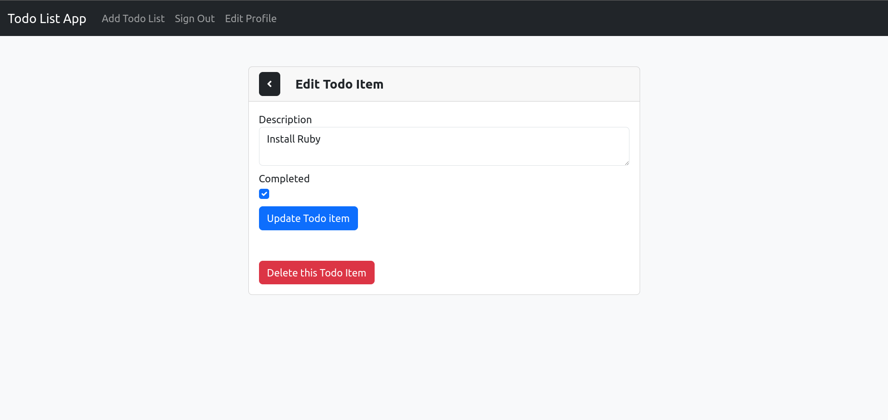

# To-Do List Project - Ruby on Rails

## Table of Contents
1. [Installation Instructions](#installation-instructions)
2. [Creating a New Rails Project](#creating-a-new-rails-project)
3. [Adding Features](#adding-features)
    - [Todo List and Todo Item Models](#todo-list-and-todo-item-models)
    - [User Authentication with Devise](#user-authentication-with-devise)
    - [Styling Devise Views](#styling-devise-views)
4. [Routing and Views](#routing-and-views)
5. [Screenshots](#screenshots)

---

## Installation Instructions

### 1. Install Ruby on Ubuntu 24.04 LTS
Follow this guide to install Ruby:
- [How to Install Ruby in Ubuntu 24.04 LTS](https://ubuntuhandbook.org/index.php/2024/01/install-ruby-ubuntu-24-04/)

### 2. Install Rails
Install Rails using the command:
```bash
gem install rails
```

### 3. Create a New Rails Project
Generate a new Rails project:
```bash
rails new project_name
```

### 4. Generate the Home Page
Generate a controller for the home page:
```bash
rails g controller home index
```

### 5. Add `nested_scaffold` Gem
Add the `nested_scaffold` gem to your Gemfile:
```ruby
gem 'nested_scaffold', '~> 1.1'
```
[Gem Documentation](https://rubygems.org/gems/nested_scaffold)

### 6. Create the Models
Generate the `TodoList` and `TodoItem` models with the following commands:
```bash
rails g scaffold TodoList title
rails g nested_scaffold TodoList/TodoItem description:text completed:boolean completed_at:datetime todo_list:references
```

### 7. Update Database
Run the migration:
```bash
rails db:migrate
```

---

## Adding Features

### Todo List and Todo Item Models
Set up your models by generating the necessary scaffolds and adding the relationship between `TodoList` and `TodoItem`.

Update `config/routes.rb`:
```ruby
resources :todo_lists do
    resources :todo_items
end
```

### User Authentication with Devise
Install the Devise gem to handle user authentication:
```ruby
gem 'devise', '~> 4.9', '>= 4.9.4'
```

Run the following commands:
```bash
bundle install
rails g devise:install
rails g devise user
rails db:migrate
```

### Styling Devise Views
Generate and style Devise views as needed to match your application's UI.

---

## Routing and Views

### Home Page
On the home page:
- If the user is signed in: Show the `todo_lists#index` page.
- If not signed in: Redirect to `users#sign_in` (login page).

### User Authorization for Todo Lists
To ensure that only the owner of a `TodoList` can edit it:
```ruby
def correct_user
    @todo_list = current_user.todo_list.find_by(id: params[:id])
    redirect_to todo_lists_path, notice: "Not Authorized To Edit This Todo List" if @todo_list.nil?
end
```

### Showing Only User's Todo Lists
In the `todo_lists` view, make sure to display only the lists that belong to the current user:
```erb
<% if todo_list.user == current_user %>
    <!-- Show Todo List -->
<% end %>
```

---

## Screenshots

Below are the screenshots of the key pages in the application.

### Login and Sign Up
Here is how the login and sign-up screens will look side by side:

| Login Screen | Sign Up Screen |
|--------------|----------------|
|  |  |

### Home Page - Todo Lists
The initial screen showing the user's todo lists:


### Todo List Details
This screen displays the items within a selected todo list:


### Todo Item Edit
The screen for editing a specific todo item:


---

## Additional Notes

- **Turbo and Delete Links**: When using the `delete` method with Turbo, ensure you follow the instructions from section 7.5 of the Rails Guides, particularly about setting the `data-turbo-method` and `data-turbo-confirm` attributes for your destroy links.
    - [Rails Getting Started Guide](https://guides.rubyonrails.org/getting_started.html)
    - [Stack Overflow Discussion](https://stackoverflow.com/questions/70446101/ruby-on-rails-7-delete-method-not-working)
  
- **Stimulus Reflex Setup**: For real-time updates in your application, integrate Stimulus Reflex:
    ```bash
    bundle add stimulus_reflex
    rails stimulus_reflex:install
    rails g stimulus_reflex TodoItem
    ```
    - The *check* **or** *redo* button on the screen displaying the items in a to-do list should switch between them, setting the status to *completed* or *incompleted*, but `stimulus_reflex` for some reason is not working, and I have not found a way to solve it despite having looked for several solutions and ways to solve it.

---

Thank you for checking out this project! If you found it helpful, please consider giving it a ⭐. Your support is greatly appreciated!